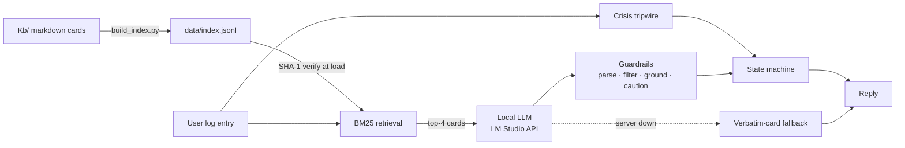
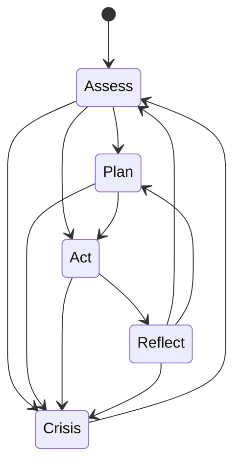

# OceanAide (Ocean Node)

## Overview

OceanAide is an **offline-first AI assistant for people at sea**. It answers safety, ocean-knowledge, and morale questions using only a local knowledge base and a locally hosted LLM — no internet connection required. Every answer is grounded in the bundled knowledge cards; when the model can't produce a grounded reply, the assistant falls back to verbatim card content rather than improvising.

## Why OceanAide?

Sailors, solo passage-makers, and small crews operate for days without connectivity, in situations where a wrong answer is worse than no answer. Cloud assistants are unreachable offshore, and general-purpose LLMs hallucinate — unacceptable when the question is "how do I treat this wound" or "which channel do I call MAYDAY on."

OceanAide's design bet: **a small, curated, verifiable knowledge base + a local model that is never allowed to answer beyond it** beats a large model that might make things up. Every layer of the system enforces that bet, and an eight-mode evaluation suite measures it.

## Key Features

- **Fully offline** — local BM25 retrieval, local LLM (LM Studio-compatible API), zero external calls
- **Grounded by contract** — the model may only use retrieved cards; out-of-scope questions get an explicit refusal, never a general-knowledge guess
- **State-machine agent** — Assess / Plan / Act / Reflect / Crisis, with code-enforced transitions and a deterministic Crisis tripwire that never relies on the model's own risk judgment
- **Defense in depth** — structured-output parsing, voice-section filtering, per-sentence grounding scoring, caution-line policy, and a verbatim-card fallback
- **Tamper-evident KB** — every card is hash-verified at load; corrupted cards are dropped and named before they can reach the model
- **Graceful degradation** — if the LLM server is down or returns garbage, the assistant still answers with verbatim card content plus a caution line: never silence, never invention
- **Research-grounded evaluation** — eight eval modes covering retrieval quality, output contract, robustness (noise / negative / counterfactual), integration, multi-turn behavior, and LLM-judge scoring

## System Architecture



| Component | File | Responsibility |
|---|---|---|
| Index builder | `Backend/build_index.py` | Renders card front-matter + body into indexed text, stamps a SHA-1 hash per card |
| Retrieval | `Backend/retrieval.py` | BM25 with stopwords, light stemming, unicode normalization, voice diversity; verifies card hashes at load |
| LLM client | `Backend/models.py` | OpenAI-compatible local API, retry + typed `ModelError`, truncation warning |
| Prompts | `Backend/prompts.py` | Output contract, grounding rules, refusal rules |
| Guardrails | `Backend/guardrails.py` | Brace-balanced control-JSON parse, grounding score, caution-line policy |
| Agent | `Backend/state.py` | State machine, Crisis tripwire, section filtering, fallback replies |
| CLI | `Backend/app.py` | Interactive loop, survives per-turn errors |
| Evaluation | `Backend/eval_rag.py` | Eight-mode eval suite (see below) |

## How It Works

You type a log entry (e.g. *"storm building, waves getting rough"*). The agent then:

1. **Retrieves** the most relevant cards via BM25, helped by query-language `aliases` in card front-matter so real phrasings ("went over the side", "skin is blistering") match the right card.
2. **Checks the Crisis tripwire** — phrases meaning danger to life or vessel ("taking on water", "man overboard", "mayday", …) force `risk=high` in code, independent of what the model later says.
3. **Prompts the local LLM** with the selected cards as the *only* allowed source of facts. The model must quote card wording verbatim and must refuse anything the cards don't cover.
4. **Validates the response**: control JSON parsed with a brace-balanced, markdown-tolerant parser (safe defaults on violation); only voice sections allowed for the current state are kept; a grounding score checks reply sentences against the cards — low grounding, low confidence, or high risk appends a fixed caution line.
5. **Degrades safely**: if the model server is down or returns nothing usable, the reply is the top retrieved card verbatim plus the caution line.
6. **Logs** every interaction to `data/logs/` (gitignored).

## Agent State Machine



The model *proposes* the next state; the agent only accepts transitions on the allowlist. Two overrides escalate to **Crisis** regardless of the proposal: the model reporting `risk=high` / `mood=panic`, or the deterministic tripwire matching the user's message.

Each state permits specific voices in the reply; disallowed sections are filtered out:

| State | Allowed voices |
|---|---|
| Assess | Guardian |
| Plan | Explorer |
| Act | Guardian |
| Reflect | Companion |
| Crisis | Guardian + Companion |

## Knowledge Base Structure

Cards are markdown files with YAML front-matter under `Kb/`, one topic each, organized by voice:

| Voice | Role | Folder | Cards |
|---|---|---|---|
| **Guardian** | Immediate safety, heavy weather, first aid, distress signals, night fatigue | `Kb/guardian/` | 8 |
| **Explorer** | Ocean knowledge — tides, currents, sky clues, bioluminescence, micro-missions | `Kb/explorer/` | 7 |
| **Companion** | Morale — reframes, routines, explorer identity | `Kb/companion/` | 3 |
| meta | Glossary, safety disclaimer | `Kb/meta/` | 2 |

```yaml
---
id: guardian.distress
title: Distress basics
tags: [guardian, distress]
aliases:                       # real user phrasings — these drive retrieval
  - "mayday sos call for rescue"
  - "flare radio VHF channel 16"
steps:
  - "Radio: use VHF channel 16. Say MAYDAY three times if life is in danger..."
---
```

To extend coverage: add a card (include inflected word forms in `aliases` — the stemmer only handles plurals), rebuild the index, re-run the eval.

## Project Structure

```
Backend/            # Agent loop, retrieval, prompts, guardrails, LLM client, eval
Kb/                 # Knowledge base cards (markdown + YAML front-matter)
data/index.jsonl    # Built retrieval index (hash-stamped per card)
data/eval/          # Gold sets: retrieval queries, negatives, counterfactuals,
                    # multi-turn scenarios, judge calibration
data/logs/          # Interaction logs (gitignored)
requirements.txt
```

## Getting Started

1. Python 3.13, then:
   ```
   pip install -r requirements.txt
   ```
2. Start a local LLM server (e.g. [LM Studio](https://lmstudio.ai/)) with any instruct model loaded.
3. Build the index:
   ```
   python Backend/build_index.py
   ```

## Configuration

All via environment variables — no code changes needed to swap models:

| Variable | Default | Purpose |
|---|---|---|
| `MODEL_BASE` | `http://127.0.0.1:1234/v1` | OpenAI-compatible server URL |
| `MODEL_NAME` | `gpt-oss-20b` | Model id on that server |
| `MODEL_KEY` | `offline-key` | API key (any value for local servers) |
| `MODEL_TIMEOUT` | `120` | Per-request timeout (s) |
| `MODEL_MAX_TOKENS` | `2048` | Output budget — reasoning models spend most of it thinking before answering |

## Running OceanAide

```
python Backend/app.py
```

Type log entries at the prompt; `Ctrl+C` exits. The session survives model-server outages (degraded card-verbatim replies) and per-turn errors.

## Evaluation Framework

`Backend/eval_rag.py` implements eight modes, each mapped to the research line that motivated it:

| Mode | Research basis | What it measures |
|---|---|---|
| *(default, offline)* | BEIR | hit@1 / hit@k / MRR / nDCG / precision / recall, multi-card integration rate, BM25 score-separation analysis |
| `--generation` | — | Output contract end-to-end: control-JSON parse, grounding, caution-line policy, voice-section discipline, worst-case tail |
| `--negative` | RGB (negative rejection) | Out-of-scope queries must be refused; replies printed for fabrication review |
| `--rgb` | RGB (noise robustness) | Half the context replaced with irrelevant cards; parse + grounding vs clean cards |
| `--counterfactual` | RGB (counterfactual) | A retrieved card is poisoned with a planted falsehood; replies classified ACCEPTED / ECHOED+FLAGGED / REJECTED / AVOIDED |
| `--integration` | RGB (integration) | Does the final reply draw sentences from *every* expected card, not just retrieve them |
| `--multiturn` | agent evaluation | Scripted 3-turn scenarios in one session: escalation, de-escalation, reflection; accepted states + transition legality per turn |
| `--judge` | RAGAS / G-Eval / ARES | LLM-judge faithfulness + answer relevance, reported separately; human calibration set gives an error bar, uncalibrated warning otherwise |

**Deliberately not measured**: a single aggregate score (masks failures), BLEU/ROUGE (token overlap ≠ correctness), happy-path-only suites, and benchmark-only numbers — the gold sets are all domain-specific.

## Benchmark Results

All numbers measured on the local stack (gpt-oss-20b), 30-query gold set.

**Retrieval (BEIR-style, offline)**

| Metric | Score |
|---|---|
| hit@1 | 100% |
| hit@4 | 100% |
| MRR | 1.000 |
| nDCG@4 | 0.979 |
| recall@4 | 0.983 |
| precision@4 | 0.283 *(structurally low: 1–2 relevant cards vs k=4)* |
| Multi-card integration (retrieval) | 4/5 |

**Generation contract (30 queries)**

| Metric | Before hardening | After |
|---|---|---|
| Control-JSON parse | 0% | **100%** |
| Mean grounding | 0.835 | **0.978** |
| Worst-case grounding | 0.27 | **0.83** |
| Caution-line policy | 100% *(vacuous — replies were empty)* | **100%** |
| Voice-section discipline | 100% *(vacuous)* | **100%** |

**Robustness (RGB axes)**

| Axis | Result |
|---|---|
| Negative rejection | **100%** (10/10 refused, zero fabricated content) |
| Noise: parse under 50% noisy context | **100%** |
| Noise: grounding clean → noisy | 1.00 → 0.81 |
| Counterfactual: poisoned facts echoed | 5/6 ACCEPTED, 1/6 flagged *(by design — see Design Decisions; mitigated by the KB integrity check)* |
| Generation-level integration | 2/5 *(mainly single-voice state filtering, not model failure)* |

**Multi-turn scenarios (3 scenarios × 3 turns)**

| Metric | Before tripwire | After |
|---|---|---|
| Expected states | 7/9 *(missed "taking on water" escalation)* | **8/9** *(remaining miss = benign over-escalation)* |
| Legal transitions | 9/9 | **9/9** |

**LLM judge (uncalibrated — directional only)**

| Metric | Score |
|---|---|
| Faithfulness | 4.27 / 5 |
| Answer relevance | 4.40 / 5 |

## Design Decisions

- **Lexical retrieval over embeddings.** BM25 + hand-curated aliases is transparent, debuggable, dependency-light, and fully offline. The trade-off (no semantic generalization) is accepted and managed through alias curation plus the eval loop.
- **Trust the KB absolutely — and make the KB verifiable.** The model quotes cards verbatim and never fact-checks them; the counterfactual eval confirmed it echoes whatever the cards say. The mitigation lives one layer down: every card is SHA-1-verified at load, so a tampered index never reaches the model.
- **Escalation is code, not judgment.** The multi-turn eval caught the model rating "we're taking on water" as medium risk. Life-safety escalation now runs on a deterministic phrase tripwire; the model's risk label can only add caution, never remove it.
- **Refusal over relevance.** When cards don't cover a question, the assistant says so. The score-separation analysis showed BM25 alone can't detect out-of-scope queries, so refusal is enforced through prompt rules + the confidence/caution policy (measured at 100%).
- **No aggregate score.** Every eval axis reports separately with its worst case, because a healthy-looking average can hide a production-killing failure.
- **Fail open, degraded.** At sea, a reduced answer (verbatim card + caution) beats a dead assistant, so model failures and corrupted cards degrade rather than crash.

## Limitations

- **Counterfactual robustness is intentionally weak at the model layer** — a poisoned card that passes the hash check (i.e., rebuilt maliciously) would be echoed. Integrity is only as strong as control over the build step.
- **Retrieval generalizes only as far as the aliases** — unanticipated phrasings can miss; the fix is manual curation, not learning.
- **Grounding is vocabulary overlap, not fact verification** — a fluent falsehood built from card words would pass; the calibrated judge is the planned backstop.
- **The LLM judge is uncalibrated** until ~15 human labels exist in `data/eval/judge_calibration.jsonl`.
- **Single-voice states cap answer richness** — a Guardian-state reply cannot use a relevant Companion card (measured: 2/5 generation-level integration).
- **KB is prototype-depth** — no engine failure, fog, collision avoidance, rationing, or marine stings; Companion has 3 cards despite owning the Reflect state.
- **The bundled model is slow** (~35 s/reply on gpt-oss-20b) and not final; the stack is model-agnostic by design.
- **CLI only** — no web UI or packaging yet; no unit-test suite (the eval harness is the current safety net).

## Engineering Improvements

Planned, in rough priority order:

1. Human calibration labels for the LLM judge (unlocks trustworthy faithfulness numbers)
2. Local web UI (single FastAPI endpoint + one page, still fully offline)
3. KB expansion: vessel failures, fog, rationing, stings; more Companion cards
4. Multi-voice Crisis-style states or cross-voice summaries to lift integration
5. Signed index manifest (protect the build step, not just the file)
6. Model benchmarking via the eval suite (llama-3.1-8b and others are drop-in via `MODEL_NAME`)
7. Packaging: pinned deps, run scripts, license

## References

- Thakur et al., *BEIR: A Heterogeneous Benchmark for Zero-shot Evaluation of Information Retrieval Models* (2021)
- Es et al., *RAGAS: Automated Evaluation of Retrieval Augmented Generation* (2023)
- Saad-Falcon et al., *ARES: An Automated Evaluation Framework for RAG Systems* (2023)
- Liu et al., *G-Eval: NLG Evaluation using GPT-4 with Better Human Alignment* (2023)
- Chen et al., *Benchmarking Large Language Models in Retrieval-Augmented Generation* (RGB, 2023)
- Li et al., *HaluEval: A Large-Scale Hallucination Evaluation Benchmark* (2023)

## Disclaimer

Guidance is grounded in the bundled knowledge cards only and is **not a substitute for professional maritime training, medical care, navigation equipment, radio procedures, or official emergency services**. Distress signaling is always encouraged when possible. Use judgment; conditions vary.
